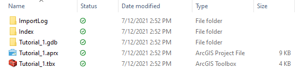

# Tutorial 1 - Software setup and introduction to datasets

- [Tutorial 1 - Software setup and introduction to datasets](#tutorial-1---software-setup-and-introduction-to-datasets)
  - [1. Install ArcGIS Pro](#1-install-arcgis-pro)
  - [2. Introduction to the GIS datasets](#2-introduction-to-the-gis-datasets)
  - [3. Create a Project in ArcGIS Pro](#3-create-a-project-in-arcgis-pro)
    - [3.1 Open ArcGIS Pro](#31-open-arcgis-pro)
    - [3.2 Create a new project](#32-create-a-new-project)
    - [3.3 The project home folder](#33-the-project-home-folder)

## 1. Install ArcGIS Pro

- **Step 1 - Download**: Follow the instruction on
  https://www.geoplan.ufl.edu/software/arcgis-pro/ to obtain a copy of the
  software.
  Make sure you download the latest version i.e., ArcGIS Pro 2.8.
  The file is located inside `AGP2.8` with a name of `ArcGISPro_28_177688.exe`.
- **Step 2 - Install**: Double-click the installation file you just downloaded
  from last step, follow the instructions to install the application on your
  computer.
- **Step 3 - Open the software**: Find the software in your start menu just as
  any other existing program on your computer.
  You can either locate it in the App list under **ArcGIS** or search for
  **ArcGIS Pro** using the Search button on your taskbar.
- **Step 4 - Log in**:  Follow the instruction on
  https://www.geoplan.ufl.edu/software/esri-login-instructions/ to login to
  ArcGIS Pro.

> :memo: **_Make sure ArcGIS Pro is up-to-date_**  
> If you already have ArcGIS Pro installed on your computer before, please
> **make sure that you have the same version** as described above.
> If not, please update the application. An _software update_ notification will
> **automatically** pop out, every time you start the software (with internet
> connection).
> Otherwise, you can go to the [_About_](https://tinyurl.com/36v9vyw4) section
> in the [**Settings**](https://tinyurl.com/yy2w7f24)
>  to manually check for update.

## 2. Introduction to the GIS datasets

- **Download** from this [Dropbox link](https://tinyurl.com/85tjxnvh)
  (password provided separately).
- Critical to be aware and acquainted with what's available.
- Identifying and acquiring useful datasets is an essential skill.
- Understanding the concepts behind different types of GIS data.
  - vector: object view (discrete)
  - raster: field view (continuous)
  - "People manipulate object but cultivate field" (Couclelis, 1992).

| Theme | ID | File Name            | Data Format | Type | Description                                               |
|-------|----|----------------------|-------------|------|-----------------------------------------------------------|
| [Demography](metadata/census/census.md) | 1   2 | CensusBlocks_2010   CensusTracts_2010 | vector   vector  | polygon   polygon   | 2010 [Census](https://www2.census.gov/geo/pdfs/reference/geodiagram.pdf) blocks   2010 Census tracts |
| [Zoning & FLU](metadata/zoning_flu.md) | 3   4   5 | ApopkaZoning   Zoning   FutureLandUse | vector   vector   vector | polygon   polygon   polygon | [City of Apopka zoning ordinance](https://library.municode.com/fl/apopka/codes/code_of_ordinances?nodeId=PTIIILADECO_ART3ZODI_S3.1GEPR)   [Orange County zoning ordinance](https://library.municode.com/fl/orange_county/codes/code_of_ordinances?nodeId=PTIIORCOCO_CH38ZO_ARTIVZODIESZOMA)   [Orange County Future Land Use](https://www.orangecountyfl.net/PlanningDevelopment/ComprehensivePlanning.aspx#.X87_PGhKj-g)                                      |
| Boundaries | 6   7   8   9 | Jurisdiction   StudyArea   PublicFacilities   PublicLand | vector   vector   vector   vector | polygon   polygon   polygon   polygon | Apopka jurisdiction map   Study area boundary (partitioned into three sections)   Orange county roads, drainage, water/waste reclaimation   Public land (federal, state, county, municipal, etc.) |
| 
 Critical Zones 
  | 10   11   12   13 | Conservation   dfirm_fldhaz_oct20   histUndBus   wetlands | vector   vector   vector   vector | polygon   polygon   polygon   polygon | Conservation areas   [FEMA flood zones](https://www.fgdl.org/metadata/metadata_archive/fgdl_html/dfirm_fldhaz_apr08.htm)   Historically underutilized business zones   National wetland inventory                                      |
| [Transit](metadata/transit.md) | 14   15 | BusRoutes   BusStops           | vector   vector   | line   point  | Bus routes ([LYNX](https://www.golynx.com/corporate-info/facts-glance.stml) data)   Bus stops (LYNX data) |
| Transport | 16   17 | rail   Streets | vector   vector | line   line | Railroads in the study area   [Street network](metadata/FUNCLASS.md) of the study area |
|  | 18   19 | taxlot   MSBFP | vector   vector | polygon   polygon | [FGDL](https://www.fgdl.org/metadataexplorer/full_metadata.jsp?docId=%7B147B34F0-9E64-49AE-8B7F-5C4999BEC541%7D&loggedIn=false) Property parcel   [Microsoft Building Footprint](https://github.com/Microsoft/USBuildingFootprints) |
| Transport | 16   17 | rail   Streets | vector   vector | line   line | Railroads in the study area   Street network of the study area |
|  | 18   19 | taxlot   MSBFP | vector   vector | polygon   polygon | [FGDL](https://www.fgdl.org/metadataexplorer/full_metadata.jsp?docId=%7B147B34F0-9E64-49AE-8B7F-5C4999BEC541%7D&loggedIn=false) Property parcel   [Microsoft Building Footprint](https://github.com/Microsoft/USBuildingFootprints) |
| [LULC](metadata/lulc/lulc.md) | 20   21 | LULC_2015   CLC_LULC | raster   vector    | grid   polygon | Land Use Land Cover ca. 2015   Cooperative Land Cover (Version 3.3)|
| [Soils](metadata/soils.md) | 22   23   24   25 | Soils   soil_agcl   soil_hgrp   soil_wt | vector   raster   raster   raster | polygon   grid   grid   grid | [SSURGO](https://www.nrcs.usda.gov/wps/portal/nrcs/detail/soils/survey/?cid=nrcs142p2_053627) soil polygons   Non-irrigated land capability class   Hydrologic soils group   Depth to water table (feet, classed)     |
| [Topography](metadata/DEM/dem.md) | 26   27   28   29 | elevation_ft   aspect   hillshade   slope_ps | raster   raster   raster   raster | tiff   tiff   grid   grid | Elevation 10m DEM (in feet)   Aspect in degrees   Hillshade (azimuth 315, altitude 45)   Slope (percent rise)  |
| Aerial Photo | 30 | orthoNAIP      | raster    | tiff        | 2015 [National Agriculture Imagery Program](https://www.fsa.usda.gov/programs-and-services/aerial-photography/imagery-programs/naip-imagery/) (NAIP)   |

## 3. Create a Project in ArcGIS Pro

ArcGIS Pro organizes your work into [projects](https://tinyurl.com/2r7vcje2).
A **project** is a collection of related items—_maps_, _layouts_, *tables*,
*charts*, *data connections*, and more—that contribute to a common purpose.
The purpose may be to (a) analyze a problem, (b) to visualize a state of
affairs, (c) to maintain or update a data model of infrastructure, or
something else.

### 3.1 Open ArcGIS Pro

The [Start page](https://tinyurl.com/5jdkbk64) consists of three sections
(columns).

1. The **Open** section: shows projects created recently.
   You can also choose to
   [**Open a project**](https://tinyurl.com/yv24vema).
2. The **New** section: shows the [templates](https://tinyurl.com/jscpxv9f)
   you can use to [Create a project](https://tinyurl.com/2yy9mt9r).
   - **_Map_**: working with 2D data (ArcMap).
   - **_Local_** and **_Global Scene_**: working with 3D data
      (ArcScene and ArcGlobe).
   - **_Catalog_**: Data management (ArcCatalog).
3. The **Resources** section: include links to blogs, tutorials, documentation,
   and highlights of recent development of the software.

### 3.2 Create a new project

Create a project using the **_Map_** template.

1. Specify the project name, e.g., *Tutorial_1*.
2. Choose a **folder** on your local drive to store the project.

### 3.3 The project home folder

- `Tutorial_1.aprx`: the _project file_ that you can **Double-click** to
  open the project.
- `Tutorial_1.gdb`: a [file geodatabase](https://tinyurl.com/4xtbkdc2), the
  [_default_](https://tinyurl.com/nm23t36r) workspace storing output data of
  [geoprocessing](https://tinyurl.com/3z98ewvf) tools.
- `Tutorial_1.tbx`: the default [Toolbox](https://tinyurl.com/5ef7jhfy) where
  new [_models_](https://tinyurl.com/usr7hktu) created in this project are
  going to be stored.

> :bulb: Don't lose your hard work. 
> Remember to [Save a project](https://tinyurl.com/wh5u4e2r) frequently to
> avoid losing your works.
