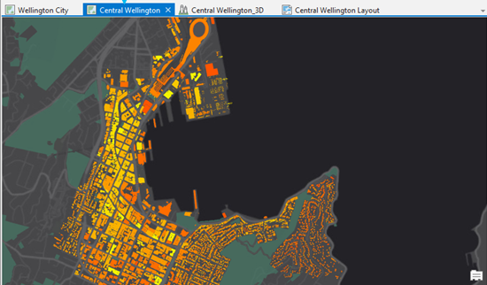
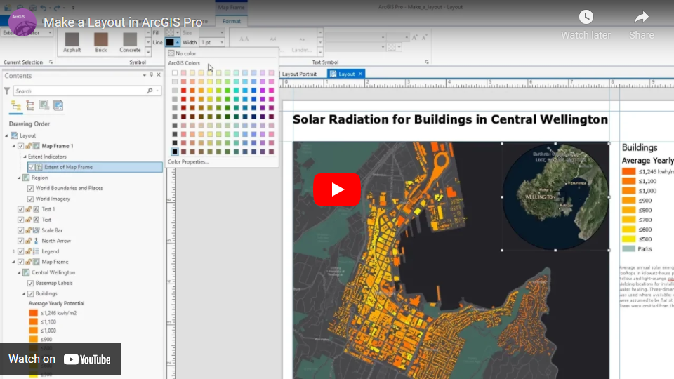

# Tutorial 2 - Get to know ArcGIS Pro

- [Tutorial 2 - Get to know ArcGIS Pro](#tutorial-2---get-to-know-arcgis-pro)
  - [1. ArcGIS Pro User Interface](#1-arcgis-pro-user-interface)
    - [1.1 Project Ribbon](#11-project-ribbon)
    - [1.2 Views](#12-views)
    - [1.3 Panes](#13-panes)
  - [2. Work with Symbology and Create a Layout](#2-work-with-symbology-and-create-a-layout)
    - [2.1 Add data to map view](#21-add-data-to-map-view)
    - [2.2 Create a _layout_](#22-create-a-layout)
  - [3. Run Tools in ArcGIS Pro](#3-run-tools-in-arcgis-pro)
    - [3.1 Finding a tool](#31-finding-a-tool)
    - [3.2 Using a tool](#32-using-a-tool)

## 1. ArcGIS Pro User Interface

The main parts of the ArcGIS Pro [interface](https://tinyurl.com/4r2j9447) are
the **_ribbon_**, **_views_**, and **_panes_**.
ArcGIS Pro is a _ribbon-based_ application.
Many commands are available from the **ribbon** at the top of the ArcGIS Pro
window; more advanced or specialized functionality is found on panes
(dockable windows) that can be opened as needed.

### 1.1 Project Ribbon

ArcGIS Pro uses a horizontal ribbon at the top of the application window to
display and organize functionality into **<ins>a series of tabs</ins>**.
Some of these tabs (core tabs) are always present.
Others (contextual tabs) appear when the application is in a particular state.

- **Map** tab: basic mapping operations
- **Insert** tab: Adding new map, scene, or layout
- **Analysis** tab: Geoprocessing, ModelBuilder, Python and more

### 1.2 Views

Views are windows for working with **_maps_**, **_scenes_**, **_tables_**,
**_layouts_**, and other presentations of data.
A project may have many views, which can be
<ins>opened and closed as needed</ins>.

| map view (2D)                             | scene view (3D)                             |
|:-----------------------------------------:|:-------------------------------------------:|
|              |  |

### 1.3 Panes

**Content Pane**:
The layers in a _map_ or _scene_ are listed in the
[Contents pane](https://tinyurl.com/seez74xb).
Use this pane to manage the display of **layers**, **symbology**, and other
**layer properties**.

- List by Drawing Order
- List by Data Source
- List by Selection

> :bulb: 
> These [keyboard shortcuts](https://tinyurl.com/ehhaahze) will improve your
> productivity when working with layers in the Content pane.

**Catalog Pane**:
The [Catalog pane](https://tinyurl.com/jmf9cuwx) has tabs across the top that
provide access to collections of items.

- **Maps** (default map): In ArcGIS Pro you can have multiple maps
  simultaneously to visualize and compare them side-by-side.
  The map concept is similar to [Data Frame](https://tinyurl.com/b4fydnms)
  in **_ArcMap_**.
- **Toolboxes**: shows toolboxes (default toolbox is automatically loaded).
- **Layouts**: if any created with the project.
- **Folders**: [Add Folder Connection](https://tinyurl.com/y9f499ym) allows you
  to quickly access existing folder on your computer in ArcGIS Pro.
- **Databases**: shows connected geodatabases

## 2. Work with Symbology and Create a Layout

### 2.1 Add data to map view

- Add **study area** boundary
- Check out the **Attribute Table**
  (keyboard shortcut: <kbd>Ctrl</kbd>+<kbd>T</kbd>)
- Work with vector symbology: [census block](metadata/census/census.md)
- Work with raster symbology: [LULC ca. 2015](metadata/lulc/lulc.md)

### 2.2 Create a _layout_

A _page layout_ (often referred to simply as a
[**layout**](https://tinyurl.com/3j6m7e5p)) is a collection of map elements
organized on a virtual page designed for map **_printing_**.
Common map elements include one or more
[**map frames**](https://tinyurl.com/fxyjvn9s) (each containing an ordered set
of map layers), a **scale bar**, a **north arrow**, a map **title**,
descriptive text, and a **legend**.

1. Insert a new _layout_.
2. Add map frame to the layout.
3. Add a _scale bar_, a _legend_, and a _north arrow_.

This video below created by ESRI gives a higher-level overview related to
basic functions and operations about the Layout.

## 3. Run Tools in ArcGIS Pro

Tools are essential for conducting spatial analysis in ArcGIS Pro.
Most _geoprocessing_ tools work on an input dataset to create an output
dataset.
Some tools modify the attributes or geometry of an input dataset.
A few tools have other effects, such as creating selections on layers or
generating messages or reports.

As a simple example, say that we would like to identify areas within a half
mile of **major roads** in the study area.
Depending on the subject of the analysis, these areas can either be considered
as (1) great transportation accessibility, (2) high volume of noise generated
by traffic, etc.

### 3.1 Finding a tool

[Finding the right tool](https://tinyurl.com/5a9jmed6) for your task is
essential.
The [Select Layer by Attributes](https://tinyurl.com/yzjyvch9) allows you to
_add_, _update_, or _remove_ a selection based on an attribute query.
The [Buffer](https://tinyurl.com/yw9ance8) tool creates buffer polygons around
input features to a specified distance.

In ArcGIS Pro, you can find a tool in the following places:

- **_Analysis_** ribbon tab.
- **_Geoprocessing_** pane.
- **_Search_** for a tool by name:
  1. at the top of the Geoprocessing pane.
  2. [Command Search](https://tinyurl.com/23y69b8p) box at the top of the
     application.

### 3.2 Using a tool

Once you have found and opened a geoprocessing tool,
[use it](https://tinyurl.com/565cxdkt) by entering **parameters** and running
the tool.
To get help for the open geoprocessing tool, hover over the Help button
 or click the button to open the tool
_help documentation_ page.

First, we will **select** _major roads_ out of all the roads in the study area.
We will use the following parameters.

- Input Rows: `Streets.shp`.
- Selection type: `New selection`.
- Expression: `FUNC_CLASS IN ('2', '3')`.

> :bulb: Does the layer you use as input have **_selected_** features? 
> Note that, in ArcGIS, geoprocessing tools only operate on selected features.
> This is a very important behavior of the software that you should always
> keep in mind.

Then, we will create **buffers** around the selected major roads.
We will use the following parameters:

- Input Features: `Streets.shp`.
- Distance: `0.5 Miles`.
- Side Type: `Full`.
- Method: `Planar`.
- Dissolve Type: `Dissolve all output features into a single feature`.
