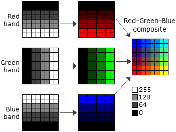
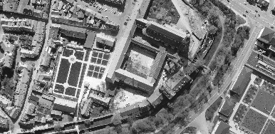
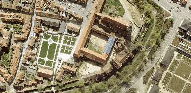
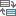
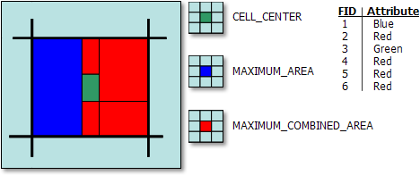
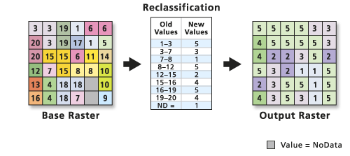
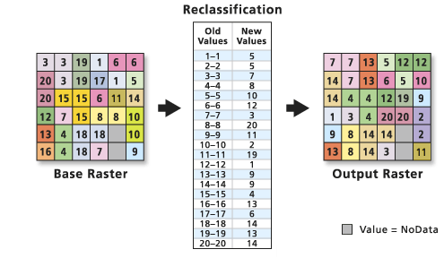
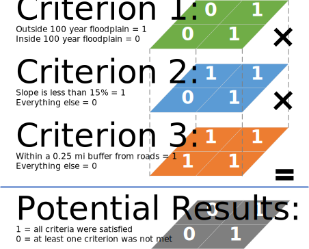
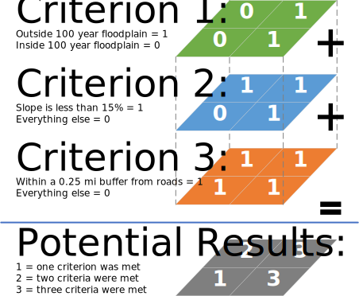
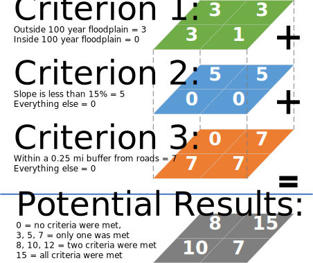

# Tutorial 3 - Introduction to Geoprocessing and Map Algebra

- [Tutorial 3 - Introduction to Geoprocessing and Map Algebra](#tutorial-3---introduction-to-geoprocessing-and-map-algebra)
  - [1. Understand Data in the Raster Format](#1-understand-data-in-the-raster-format)
    - [1.1 Single-band raster dataset](#11-single-band-raster-dataset)
    - [1.2 Multiple-band raster dataset](#12-multiple-band-raster-dataset)
    - [1.3 Comparison between display in single band and multi-band](#13-comparison-between-display-in-single-band-and-multi-band)
  - [2. Convert Vector Data to Raster Data](#2-convert-vector-data-to-raster-data)
    - [2.1 Add field](#21-add-field)
    - [2.2 Calculate field](#22-calculate-field)
    - [2.3 Polygon to raster](#23-polygon-to-raster)
  - [3. Raster Data Reclassification](#3-raster-data-reclassification)
  - [4. Map Algebra](#4-map-algebra)
    - [4.1 Multiply binary values](#41-multiply-binary-values)
    - [4.2 Add binary values](#42-add-binary-values)
    - [4.3 Add unique values](#43-add-unique-values)
  - [5. Exercise - A test drive on overlay analysis](#5-exercise---a-test-drive-on-overlay-analysis)

Geoprocessing is a framework and set of tools for processing geographic and
related data.
A typical geoprocessing tool performs an operation on a dataset such as a
feature class, raster, or table, and creates a resulting output dataset.
It is at the core of ArcGIS Pro's power in _data management_,
_geospatial analysis_, and workflow _automation and customization_.

## 1. Understand Data in the Raster Format

In its simplest form, a raster consists of **a matrix of cells** (or pixels)
organized into _rows_ and _columns_ (or a grid) where
<ins>each cell contains a value</ins> representing information, such as
temperature.
Raster grids can be outputs from raster analysis, digital aerial photographs,
imagery from satellites, digital pictures, or even scanned maps.

Data stored in a raster format represents **real-world phenomena**.

### 1.1 Single-band raster dataset

Values in a single-band raster dataset may represent temperature, elevation,
soil pH value, etc.
The three main ways to display single-band raster datasets are shown below.

- using two colors (binary)
- grayscale
- color map

### 1.2 Multiple-band raster dataset

When there are _multiple bands_, every cell location has more than one value
associated with it.
A satellite image, for example, commonly has multiple bands representing
different wavelengths from the _ultraviolet_ through the _visible_ and
_infrared_ portions of the electromagnetic spectrum.
For example, the aerial photo (or basemap) of the study area,
[orthoNAIP1.tif](1-software_and_data.md#2-introduction-to-the-gis-datasets),
is a **3-band** [orthophoto](https://tinyurl.com/y4w7xp54) that is acquired
from both aircraft (using digital camera) and satellite imagery.
The three bands are RGB stands for red, green, and blue respectively.
The RGB composite can display the raster dataset in **natural color**.

> :bulb: The term **_band_** originated from the reference to the _color band_
> on the electromagnetic spectrum.

### 1.3 Comparison between display in single band and multi-band

|    single-band satellite image     |    3-band RGB composite satellite image    |
|:----------------------------------:|:------------------------------------------:|
|     |     |

## 2. Convert Vector Data to Raster Data

In most cases, the input data for land use analysis come in different formats,
i.e., some as raster and others as vector.
To use them together properly, we need to convert datasets between vector
and raster formats back and forth.
This example below shows how we can convert a
[floodplain](1-software_and_data.md#critical_zones) dataset from
**vector polygons** to a **raster grid** by using a variety of geoprocessing
functions (tools).
The final output is a raster layer with binary values, where `1` indicates
areas outside 100-year floodplain, and `0` otherwise.

### 2.1 Add field

The [Add Field](https://tinyurl.com/hd2d4bf3) tool allows you to add a new
field to a table or the table of a feature class or feature layer, as well as
to rasters with attribute tables.

- Input Table: `dfirm_fldhaz_oct20.shp`.
- Field Name: `NOTFLDPLN`.
- Field Type: `Short (small integer)`.

We can also "add field" interactively inside the Attribute Table
 through
[_Fields view_](https://tinyurl.com/y4xpw72m).

### 2.2 Calculate field

The [Calculate Field](https://tinyurl.com/wvdffrbw) tool calculates the values
of a field for a feature class, feature layer, or raster.

But first, we need to use **_Select by Attributes_** introduced in
[Tutorial 2](2-learn_arcpro.md#3-run-tools-in-arcgis-pro) to select areas that
are not identified as floodplain.

- Input Table: `dfirm_fldhaz_oct20.shp`.
- Field Name: `New selection`.
- Expression: `FLOODPLAIN = 'OUTSIDE FLOODPLAIN'`.

Parameters for Calculate field:

- Input Table: `dfirm_fldhaz_oct20.shp`.
- Selection Type: `NOTFLDPLN`.
- Expression: `1`.

**Switch**  the selection to assign the rest of
the features with a value of **0**.

### 2.3 Polygon to raster

The [Polygon to Raster](https://tinyurl.com/wmr3ysa2) converts polygon features
to a raster dataset.

- Input Features: `dfirm_fldhaz_oct20.shp`.
- Value field: `NOTFLDPLN`.
- Cellsize: `5 meters`.
- Cell assignment type: `Maximum combined area`. 
  

## 3. Raster Data Reclassification

The [Reclassify](https://tinyurl.com/5wf2rphs) tool allows you to make changes
to the values in a raster dataset based on specified _rules_.
In general, there are two types of reclassification rules:
[Reclass by range of values](https://tinyurl.com/wf8nj43y) and
[Reclass by individual values](https://tinyurl.com/75edhefp).

|      reclass by range of values     |    reclass by individual values     |
|:-----------------------------------:|:-----------------------------------:|
|  |  |

Example of reclassify by range of values:

- Input data: `slope_ps`
- Reclass field: `VALUE`
- Reclassification:
  | Start  | End    | New    |
  |--------|--------|--------|
  | 0      | 10     | 1      |
  | 10     | 45     | 0      |
  | NODATA | NODATA | NODATA |

Example of reclassify by individual values:

- Input data: output from Section 1
- Reclass field: `Value`
- Reclassification:
  | Value  | New    |
  |--------|--------|
  | 0      | 0      |
  | 1      | 3      |
  | NODATA | NODATA |

## 4. Map Algebra

Map Algebra is a simple and powerful algebra with which you can execute all
_Spatial Analyst tools_, **_operators_**, and _functions_ to perform geographic
analysis.
In the scope of this Studio, when talking about map algebra, we only refer to
the mathematical operations of multiple raster datasets.
Although such operations are called map algebra in a narrow sense, they are
essential for the method of overlay suitability analysis.
We will see 3 kinds of overlay analysis in the following section.

The [Raster Calculator](https://tinyurl.com/2t92nhw5) tool executes Map Algebra
expressions.
The tool has an easy-to-use calculator interface from which "most" Map Algebra
statements can be created by simply clicking buttons.

### 4.1 Multiply binary values

Objective: Just need to know places where ALL of the criteria are met.
Don’t care which ones or how many.

- Landscape feature of interest = 1
- Everything else = 0 
  

### 4.2 Add binary values

Objective: Need to know how many criteria are met and rank order.
Don’t need to identify unique criteria.

- Landscape feature of interest = 1
- Everything else = 0 
  

### 4.3 Add unique values

Objective: Need to know how many criteria were met, what they are, and in what
combinations.

- Landscape feature of interest = 3, 5, 7, etc. (prime numbers)
- Everything else = 0 
  

## 5. Exercise - A test drive on overlay analysis

Please follow the instruction and complete [Exercise 1](exercise1.md) and
[Exercise 2](exercise2.md)
