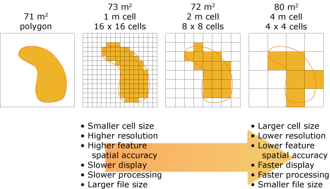
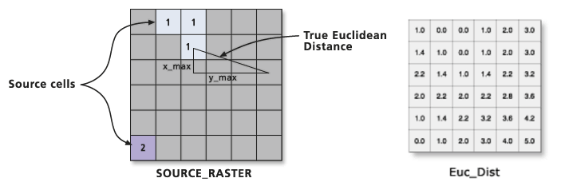
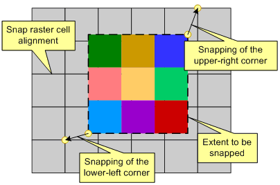
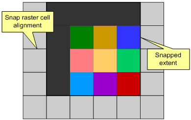
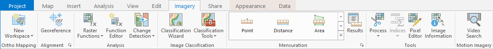
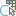
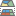

# Tutorial 3 - Landscape Design with Raster Data

- [Tutorial 3 - Landscape Design with Raster Data](#tutorial-3---landscape-design-with-raster-data)
    - [1.4 Fundamental Properties of a Raster Dataset](#14-fundamental-properties-of-a-raster-dataset)
  - [2. Run Raster tools in ArcGIS Pro](#2-run-raster-tools-in-arcgis-pro)
    - [2.2.](#22)
    - [2.3. Euclidean Distance](#23-euclidean-distance)
    - [2.4. Slice (reclassification)](#24-slice-reclassification)
    - [2.5. Raster Calculator](#25-raster-calculator)
  - [3. Raster Processing Environment](#3-raster-processing-environment)
  - [2. Create a Contour Map](#2-create-a-contour-map)
    - [2.1 The Contour geoprocessing tool](#21-the-contour-geoprocessing-tool)
    - [2.2 Working with symbology and label](#22-working-with-symbology-and-label)
  - [3. The Pixel Editor](#3-the-pixel-editor)
    - [3.1 Preparation](#31-preparation)
    - [3.2 Interactively edit classified pixels](#32-interactively-edit-classified-pixels)
    - [3.3 Reclassify using information from a feature class](#33-reclassify-using-information-from-a-feature-class)

### 1.4 Fundamental [Properties of a Raster Dataset](https://pro.arcgis.com/en/pro-app/latest/help/data/imagery/raster-dataset-properties.htm)

- Spatial Reference (projection): [GCS vs. PCS](https://www.esri.com/arcgis-blog/products/arcgis-pro/mapping/coordinate-systems-difference/)
<br> 
- Extent: The top, bottom, left, and right coordinates of the rectangle (boundary) containing the raster dataset.
- Cell Size: determines how detailed or coarse of the information presented by the raster dataset. <br> 

## 2. Run Raster tools in ArcGIS Pro


### 2.2. 

### 2.3. [Euclidean Distance](https://pro.arcgis.com/en/pro-app/tool-reference/spatial-analyst/euclidean-distance.htm)

- Input data: [BusStops.shp](../datasets/transit.md)
- Cell size: _100 meter_
- Distance method: Planer (2D plane) vs. Geodesic (3D ellipsoid) <br> 

### 2.4. [Slice](https://pro.arcgis.com/en/pro-app/tool-reference/spatial-analyst/slice.htm) (reclassification)

- Input data: _output of **Euclidean Distance** tool_ <br>

- Slice Method
  - **_Equal interval_**: Determines the range of the input values and divides the range into the specified number of output zones. (same range with each zone)
  - **_Equal area_**: Specifies that the input values will be divided into the specified number of output zones, with each zone having a similar number of cells. (same area with each zone)
  - [**_Natural breaks_**](https://www.spatialanalysisonline.com/HTML/index.html?classification_and_clustering.htm#:~:text=Natural+breaks%2FJenks): Natural Breaks classes are based on natural groupings inherent in the data.Class breaks are identified that best group similar values and that maximize the differences between classes. Natural breaks are data-specific classifications and not useful for comparing multiple maps built from different underlying information. <br> 

### 2.5. [Raster Calculator](https://pro.arcgis.com/en/pro-app/tool-reference/spatial-analyst/raster-calculator.htm)

- Input data: [elevation_ft.tif](metadata/DEM/dem.md), [lulc2015.tif](../datasets/lulc/lulc.md)
- [Map Algebra Expression](https://pro.arcgis.com/en/pro-app/help/analysis/spatial-analyst/mapalgebra/working-with-operators.htm)
- Example functions:
  1. raise elevation by 10 feet.
  2. convert elevation from feet to meter (1 m = 3.28084 ft).
  3. get residential only from lulc.
  4. create a raster grid only contain elevation information for residential areas.

## 3. Raster Processing [Environment](https://pro.arcgis.com/en/pro-app/latest/tool-reference/environment-settings/an-overview-of-geoprocessing-environment-settings.htm)

General info about [Geoprocessing environment settings](https://pro.arcgis.com/en/pro-app/latest/tool-reference/environment-settings/what-is-a-geoprocessing-environment.htm).

"**_MESC_**" are the four most important environment settings for raster analysis.

- [Mask](https://pro.arcgis.com/en/pro-app/tool-reference/environment-settings/mask.htm): set by feature class or raster dataset <br> 
- [Extent](https://pro.arcgis.com/en/pro-app/tool-reference/environment-settings/output-extent.htm): set by feature class, raster dataset, or coordinates of the sides of the rectangle (Left, Right, Top, and Bottom). <br> 
- [Snap raster](https://pro.arcgis.com/en/pro-app/tool-reference/environment-settings/snap-raster.htm): set by a raster dataset. <br> 
  |            no snapping raster            |            with snapping raster                |
  |:----------------------------------------:|:----------------------------------------------:|
  |  |      |

- [Cell size](https://pro.arcgis.com/en/pro-app/tool-reference/environment-settings/cell-size.htm): set by a raster dataset or number.

Example:

1. Re-visit Euclidean Distance.
2. Set the mask.

Save a raster grid for sharing (not FGDB)


- [Soils.shp](../datasets/soils.md)
- Value field: ```corsteel``` (Corrosion Steel): Susceptibility of uncoated steel to corrosion when in contact with the soil.

## 2. Create a Contour Map

Contours are lines that connect locations of equal value in a raster dataset
that represents continuous phenomena such as **_elevation_**, _temperature_,
_precipitation_, _pollution_, or _atmospheric pressure_.
The line features connect cells of a constant value in the input.

> :bulb:<br>
> Contour lines are often generally referred to as isolines.
> In terms of elevation, the areas where the contours are closer together
> indicate the steeper locations.

### 2.1 The Contour geoprocessing tool

- _Input data_: [elevation_ft.tif](metadata/DEM/dem.md)
- _Geoprocessing tool_: [Contour (Spatial Analyst)](https://tinyurl.com/d9rkh598)
- _Parameters_
  - Contour Interval: **1**
  - Base contour: **0**
  - Z factor: **0.3048**
  - Contour type: **Contour**

### 2.2 Working with symbology and label

- Use color scheme: _Red-Yellow-Blue_
- Add labels to contour map


## 3. The Pixel Editor

Pixel Editor contains a set of tools used to interactively
**manipulate pixel values** for raster and imagery data.
It allows you to edit an individual pixel or a group of pixels at one time.
For the purpose of this studio, you may use the **Pixel Editor** to reclassify
pixels, namely changing the current land use of the area represented by those
pixels to _demonstrate your design ideas_.

### 3.1 Preparation

The output of _image classification_, a task of assigning classes to all
pixels in a (remotely sensed) image, is a _thematic classified raster dataset_.
The [LULC_2015](metadata/lulc/lulc.md) raster dataset is an output of such
image classification process, plus posterior adjustments based on features from
other vector data.
Due to these adjustments, the raster dataset lost the thematic characteristic.
Thus, the first step to use the Pixel Editor on _LULC_2015_ is to restore the
thematic property.

**Steps** (only needed when raster dataset is not thematic data):

1. Make a copy of the original raster dataset:
   [Copy Raster](https://tinyurl.com/25a4hem8)
2. Change the _Data Source_ type to **Thematic**:
   [Set Raster Properties](https://tinyurl.com/3j4uk8m5)

### 3.2 Interactively edit classified pixels

1. Select (click on) the raster layer in the _Contents_ pane.
2. Go to the **Imagery** tab.<br>
   
3. Click on the **Pixel Editor** .
4. In the **Edit** group, specify **_Current Class_** and **_New Class_**.
5. Three options:
   1. Reclassify Pixel 
   2. Reclassify Object 
   3. Reclassify Region 

### 3.3 Reclassify using information from a feature class

In many occasions, information, such as shapes and boundaries, from a vector
layer can be used to guide your decisions on where should land-use changes
occur.
For example, the [taxlot](1-software_and_data.md#property) data containing
parcels that reflects property ownerships can be used as a reference to
determine the site of a proposed newly developed neighborhood.

1. Start a Pixel Editor session.
2. Use a feature to create your region.
3. Rasterize the region .
4. Save your edits.
