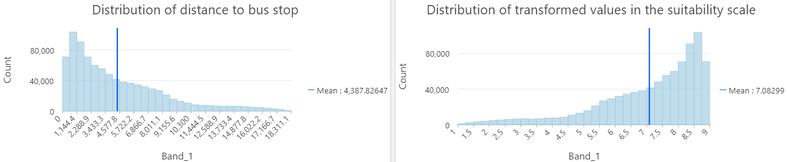

# Tutorial 5 - Suitability Analysis Workflow and Creating Contour Maps

- [Tutorial 5 - Suitability Analysis Workflow and Creating Contour Maps](#tutorial-5---suitability-analysis-workflow-and-creating-contour-maps)
  - [1. The General Workflow of Suitability Analysis](#1-the-general-workflow-of-suitability-analysis)
    - [1.1 Define Criteria](#11-define-criteria)
    - [1.2 Transform to a common suitability scale](#12-transform-to-a-common-suitability-scale)
    - [1.3 Weight the criteria and create a suitability map](#13-weight-the-criteria-and-create-a-suitability-map)
  - [2. Create a Contour Map](#2-create-a-contour-map)
    - [2.1 The Contour geoprocessing tool](#21-the-contour-geoprocessing-tool)
    - [2.2 Working with symbology and label](#22-working-with-symbology-and-label)

## 1. The General Workflow of Suitability Analysis

**Suitability** is a measure of the *relative degree* to which a land unit is
suitable for a <ins>specified purpose</ins>.
The decision on suitability is based strictly on its **current condition** and
**the context** in which it is found.
It neither anticipates nor requires any change for the assignment of a
suitability score.
Suitability modeling is the process of determining **_suitability_**.
Its output is usually presented in the form of a **suitability map**.

In this tutorial, we will use the tools we have learned so far to create a
suitability model from scratch.

### 1.1 Define Criteria

The first step to create a suitability model is to identify the criteria for
the subject of the model.
Each criterion identified should be instrumental in reaching the overall goal
of the model.
For example, if we want to measure suitability for **high-density** (greater
than 20 units per acre) **residential** development.

- Low susceptibility of uncoated steel to corrosion when in contact with the
  soil.
- Alternative transport solution.
- Good accessibility to parks and recreational areas.

The following table summarizes how we can quantify the above criteria.

| Dataset      | Field    | Value  | Geoprocessing                              |
|--------------|----------|--------|--------------------------------------------|
| Soils.shp    | corsteel | n/a    | Polygon to Raster                          |
| BusStops.shp | n/a      | n/a    | Euclidean Distance                         |
| lulc2015.tif | n/a      | 37, 40 | Extract by Attributes + Euclidean Distance |

### 1.2 Transform to a common suitability scale

All three criteria described above influence, although in different magnitudes,
how a piece of land unit is suitable for a proposed high-density residential
development.
Therefore, to determine suitability for orchards, we need to combine these
criteria in _a meaningful way_.
However, in this case, and virtually all suitability analyses, criteria are
measured in **different** [measurement levels](https://tinyurl.com/jh8n7hzh),
i.e., nominal, ordinal, interval, and ratio at different scales.
Hence, transformation is needed for each criterion from its original scale to
<ins>a common suitability scale</ins>.

In general, there are 3 transformation methods:

- **Unique categories**: is a one-to-one matching of the criterion value to
  the suitability value and best for _nominal_ and _ordinal_ data.
- **Range of classes**: is applied when ranges of values can be grouped into
  _homogeneous_ classes that can be assigned the same suitability preference.
  It is usually used for _interval_ and _ratio_ data.
- **Continuous functions**: applies linear or nonlinear functions to transform
  the values continuously to the suitability scale.
  Because this method applies a continuous function to the criterion values,
  with each increase in the criterion value, the resulting suitability value
  continuously changes.
  It is best for criteria represented by _ratio_ (or continuous) data such as
  slope, aspect, or distance.

Transformation for criterion 1 - unique categories

| corsteel | old value | new value |
|----------|-----------|-----------|
| (empty)  | 2         | 1         |
| High     | 4         | 4         |
| Moderate | 3         | 7         |
| Low      | 1         | 9         |

Transformation for criterion 2 - range of classes

| old value  | new value |
|------------|-----------|
| below 640* | 9         |
| 640-1200   | 7         |
| 1200-2000  | 3         |
| above 2000 | 1         |

*: assuming 1.33 m/s, or **80 m/min** (source: Public transport accessibility
level - PTAL methodology developed by **Transport for London**)

<a id="rescale">Transformation for criterion 3 - Continuous function</a>

- Geoprocessing: `Rescale by Function`.
- Transformation: `Linear`.
- From scale: `9`.
- To scale: `1`.

> :bulb: The "from scale" is greater than the "to scale" for a negative linear
> relationship.

### 1.3 Weight the criteria and create a suitability map

To merge the criteria, we need to assign weights to them.
Note that, no matter what weight you give to a criterion individually, the sum
of total weights for all criteria should be equal to "1" or "100%".
You can pick up the weights based on relevant literature or your own knowledge
or preferences about the subject.
For example, 30%, 30%, and 40% for the each criteria described above
respectively.

Here, we introduced a so-called rank sum method to help you determine weights.
It is a simple method to assign weights by arranging the criteria (layers) in
**rank order** where the value 1 signifies most important, 2 next important,
and so on, to the nth important criteria.
The following equation and table explains how the method works.

  

| Criterion | rank | inverse ranking | weight    |
|-----------|------|-----------------|-----------|
| soil      | 3    | 1               | 1/6=0.167 |
| transit   | 2    | 2               | 2/6=0.333 |
| park      | 1    | 3               | 3/6=0.5   |

Now, we can use the [weighted sum](https://tinyurl.com/33cjevph) tool to
overlay (multiplying each by their given weight and summing them together)
multiple criteria.

## 2. Create a Contour Map

Contours are lines that connect locations of equal value in a raster dataset
that represents continuous phenomena such as **_elevation_**, _temperature_,
_precipitation_, _pollution_, or _atmospheric pressure_.
The line features connect cells of a constant value in the input.

> :bulb: 
> Contour lines are often generally referred to as isolines.
> In terms of elevation, the areas where the contours are closer together
> indicate the steeper locations.

### 2.1 The Contour geoprocessing tool

- _Input data_: [elevation_ft.tif](metadata/DEM/dem.md)
- _Geoprocessing tool_: [Contour (Spatial Analyst)](https://tinyurl.com/d9rkh598)
- _Parameters_
  - Contour Interval: **1**
  - Base contour: **0**
  - Z factor: **0.3048**
  - Contour type: **Contour**

### 2.2 Working with symbology and label

- Use color scheme: _Red-Yellow-Blue_
- Add labels to contour map

