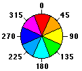
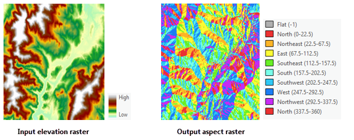
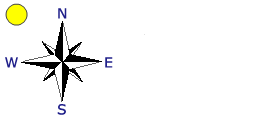
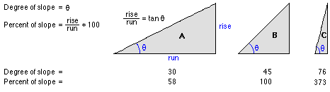

# Topography

- the study of the forms and features of land surfaces
- [not to be confused with Topology](http://geospatial-solutions.com/topology-is-not-topography/)

## 1. [Digital Elevation Model (DEM)](https://pro.arcgis.com/en/pro-app/latest/tool-reference/spatial-analyst/exploring-digital-elevation-models.htm)

- Data name: elevation_ft (value represents the number of feet above sea level)
- A raster representation of a continuous surface.
- Source: U.S. Geological Survey (USGS)
- [Program: 3D Elevation Program (3DEP)](https://www.usgs.gov/core-science-systems/ngp/3dep/about-3dep-products-services?qt-science_support_page_related_con=0#qt-science_support_page_related_con)
- The base information for creating the following three raster grids

## 2. [Aspect](https://pro.arcgis.com/en/pro-app/latest/tool-reference/spatial-analyst/how-aspect-works.htm)

- Data name: aspect2
- Value:
  - the direction the downhill slope faces
  - 
  - Flat areas are given a value of -1
- Usage:
  - flat surface (no downhills)
  - all south facing locations (higher solar illumination)
  - all north facing locations (quality ski runs)

## 3. [Hillshade](https://pro.arcgis.com/en/pro-app/latest/tool-reference/spatial-analyst/how-hillshade-works.htm)

- Data name: hillshade
- Value ranges from (0-255)
  - 0: the darkest
  - 255: the brightest
- Usage: Mainly for visualization purposes
- Two parameters
  - Azimuth (315 degree by default)
  - 
  - Altitude (45 degree by default)
  - 

## 4. [Slope](https://pro.arcgis.com/en/pro-app/latest/tool-reference/spatial-analyst/how-slope-works.htm)

- Data name: slope_ps
- Value ranges from (0-infinity)
- Illustration:
- 