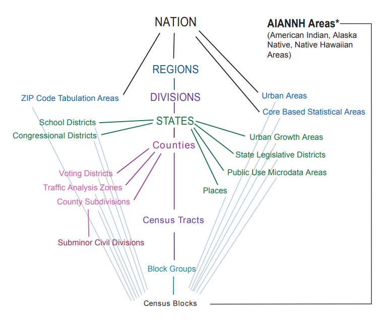
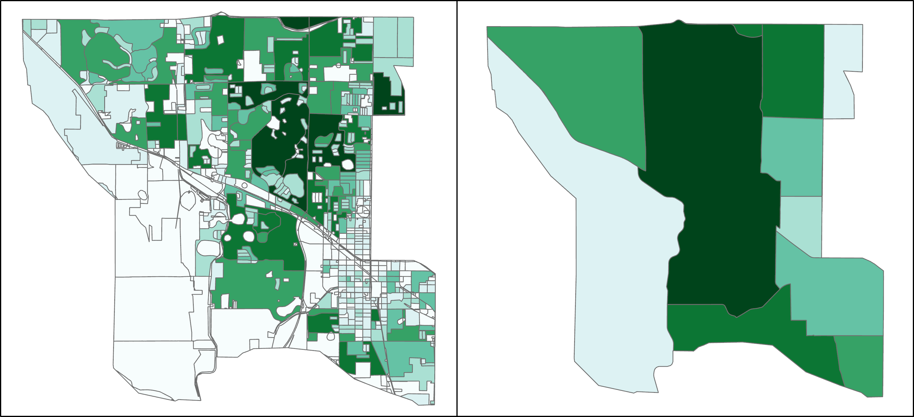

# Census Data

## 1. [Standard Hierachy of Census Geographic Entities](https://www.census.gov/programs-surveys/geography/guidance/hierarchy.html)

    
    
<strong>Source: U.S. Census Bureau<strong>

## 2. Comparison

- left: census block
- right: census tract

## 3. Demographic information

1. Population/Households
2. Racial group
3. Age
4. Housing unit
