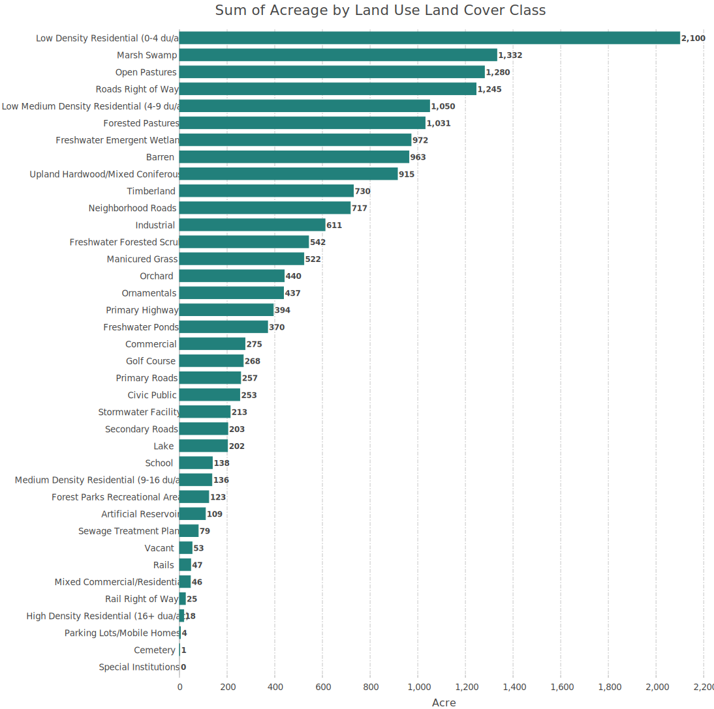

# Land Use Land Cover 

## [1. Land use land cover map ca. 2015](lulc_ca2015_print.pdf)

- Data format: Raster
- Created based on multiple sources, hence "circa".
  - image classification using machine learning algorithms
  - vector shapes: water body, property parcels, etc.
- [Colormap](lulc_2015_cmap.clr): symbology to use for visual purposes

| Value | Acres | Description                                | Hex color code |
|-------|-------|--------------------------------------------|----------------|
| 10    | 394   | Primary Highway                            | E1E1E1         |
| 11    | 257   | Primary Roads                              | CCCCCC         |
| 12    | 203   | Secondary Roads                            | B2B2B2         |
| 13    | 717   | Neighborhood Roads                         | 9C9C9C         |
| 14    | 47    | Rails                                      | 343434         |
| 15    | 1245  | Roads Right of Way                         | CCCCCC         |
| 16    | 25    | Rail Right of Way                          | B2B2B2         |
| 20    | 109   | Artificial Reservoir                       | BEE8FF         |
| 21    | 79    | Sewage Treatment Plant                     | BEFFE8         |
| 22    | 972   | Freshwater Emergent Wetland                | 00E6A9         |
| 23    | 542   | Freshwater Forested Scrub                  | 00FFC5         |
| 24    | 1332  | Marsh Swamp                                | 00A884         |
| 25    | 202   | Lake                                       | 00C5FF         |
| 26    | 370   | Freshwater Ponds                           | 00C5FF         |
| 27    | 213   | Stormwater Facility                        | BEE8FF         |
| 30    | 2100  | Low Density Residential (0-4 du/ac)        | FFFFBE         |
| 31    | 1050  | Low Medium Density Residential (4-9 du/ac) | FFBEBE         |
| 32    | 136   | Medium Density Residential (9-16 du/ac)    | FFD37F         |
| 33    | 18    | High Density Residential (16+ dua/ac)      | A87000         |
| 34    | 46    | Mixed Commercial/Residential               | FF7F7F         |
| 35    | 275   | Commercial                                 | E64C00         |
| 36    | 611   | Industrial                                 | 9C9C9C         |
| 37    | 253   | Civic Public Open Space                    | 6699CD         |
| 38    | 138   | School                                     | 70A800         |
| 39    | 1     | Cemetery                                   | 70A800         |
| 40    | 123   | Forest Parks Recreational Areas            | 267300         |
| 41    | 915   | Upland Hardwood/Mixed Coniferous           | 267300         |
| 42    | 440   | Orchard                                    | 728944         |
| 43    | 437   | Ornamentals                                | 728944         |
| 44    | 522   | Manicured Grass                            | D1FF73         |
| 45    | 730   | Timberland                                 | 728944         |
| 46    | 268   | Golf Course                                | AAFF00         |
| 47    | 963   | Barren                                     | F0F0F0         |
| 48    | 1280  | Open Pastures                              | D7C29E         |
| 49    | 1031  | Forested Pastures                          | 267300         |
| 50    | 53    | Vacant                                     | 191919         |
| 51    | 4     | Parking Lots/Mobile Homes                  | D7D79E         |
| 52    | 0     | Special Institutions                       | 004975         |

## 2. [Cooperative Land Cover (Version 3.3)](https://www.fnai.org/LandCover.cfm)

- Data format: Vector
- Extent: statewide
- Source:
  - Florida Fish and Wildlife Conservation Commission (FWC)
  - Florida Natural Areas Inventory (FNAI)
- Goal:
  - Fill a priority data gap of Florida's State Wildlife Action Plan (SWAP) for improved habitat mapping
  - Inform conservation and management activities
- [Florida Land Cover Classification System](https://myfwc.com/media/20455/land-cover-classification-revision-2018.pdf)

| Land Cover Code | Land Cover Description                            |
|-----------------|---------------------------------------------------|
| 1110            | Upland Hardwood Forest                            |
| 1120            | Mesic Hammock                                     |
| 1150            | Xeric Hammock                                     |
| 1240            | Sandhill                                          |
| 1311            | Mesic Flatwoods                                   |
| 1400            | Mixed Hardwood-Coniferous                         |
| 1500            | Shrub and Brushland                               |
| 1821            | Low Intensity Urban                               |
| 18211           | Urban Open Land                                   |
| 18212           | Residential, Low Density                          |
| 182111          | Urban Open Forested                               |
| 182131          | Parks and Zoos                                    |
| 182132          | Golf courses                                      |
| 182134          | Cemeteries                                        |
| 182135          | Community rec. facilities                         |
| 1822            | High Intensity Urban                              |
| 18221           | Residential, Med. Density - 2-5 Dwelling Units/AC |
| 18222           | Residential, High Density > 5 Dwelling Units/AC   |
| 18223           | Commercial and Services                           |
| 18224           | Industrial                                        |
| 18225           | Institutional                                     |
| 1831            | Rural Open                                        |
| 1832            | Rural Structures                                  |
| 18311           | Rural Open Forested                               |
| 183314          | Unimproved/Woodland Pasture                       |
| 1840            | Transportation                                    |
| 1850            | Communication                                     |
| 1860            | Utilities                                         |
| 1870            | Extractive                                        |
| 2140            | Floating/Emergent Aquatic Vegetation              |
| 2111            | Wet Prairie                                       |
| 2112            | Mixed Scrub-Shrub Wetland                         |
| 2120            | Marshes                                           |
| 21211           | Depression Marsh                                  |
| 21212           | Basin Marsh                                       |
| 2233            | Mixed Wetland Hardwoods                           |
| 2240            | Mixed Hardwood Coniferous Swamps                  |
| 2211            | Cypress                                           |
| 2221            | Wet Flatwoods                                     |
| 22311           | Bay Swamp                                         |
| 22323           | Cabbage Palm Hammock                              |
| 3000            | Lacustrine                                        |
| 3113            | Flatwoods/Prairie/Marsh Lake                      |
| 3117            | Sandhill Lake                                     |
| 3220            | Artificial Impoundment/Reservoir                  |
| 3240            | Sewage Treatment Pond                             |
| 3250            | Stormwater Treatment Areas                        |
| 3260            | Industrial Cooling Pond                           |
| 4000            | Riverine                                          |
| 4220            | Ditch/Artificial Intermittent Stream              |
| 183312          | Field Crops                                       |
| 183321          | Citrus                                            |
| 183332          | Coniferous Plantations                            |
| 183341          | Tree Nurseries                                    |
| 183343          | Ornamentals                                       |
| 183351          | Feeding Operations                                |
| 183352          | Specialty Farms                                   |
| 183313          | Improved Pasture                                  |
